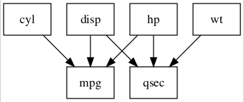

```{r setup, include = FALSE, eval = FALSE}
library(lavaan)
library(lavaanPlot)
library(rsvg)
library(magrittr)
library(DiagrammeRsvg)
```

Functions for embedding plots in Rmarkdown pdfs and for saving plots as pngs


`embed_plot_pdf()` saves your plot as a pdf image and then inserts that image into the pdf when you render Rmardown doc.

`save_png()` as the name suggests, saves your plot as a png image in the local directory (or wherever you tell it to).

```{r, eval = FALSE}
model <- 'mpg ~ cyl + disp + hp
          qsec ~ disp + hp + wt'

fit <- sem(model, data = mtcars)

pl <- lavaanPlot(model = fit)

# Example for pdf embed
embed_plot_pdf(pl, "plot2.pdf", width = 500)

# Example for saving to .png
save_png(pl, "plot.png", width = 500)
```

Now having saved the image, it can be embedded in the document with ``



